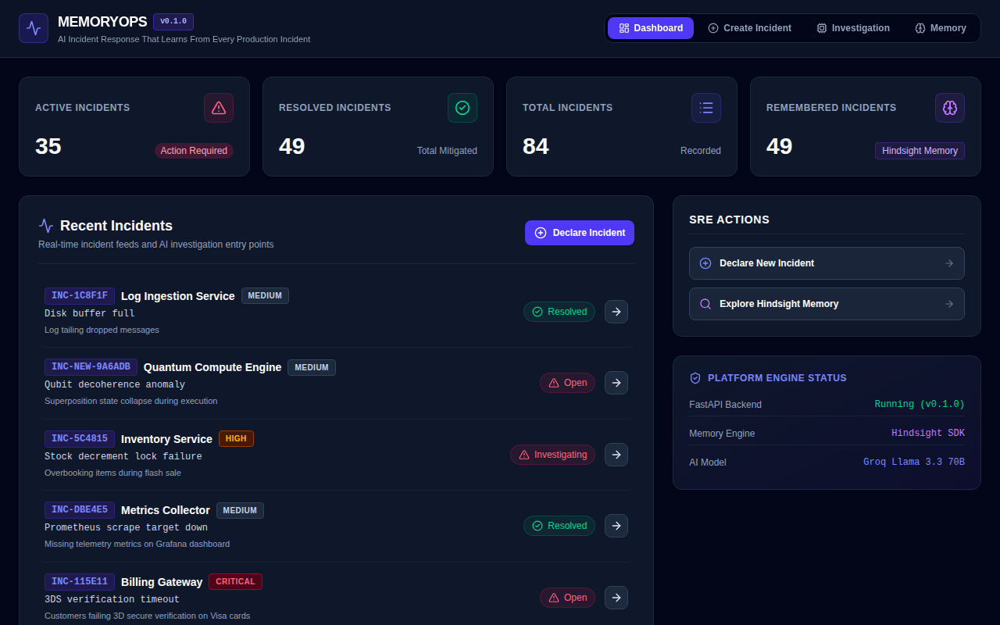
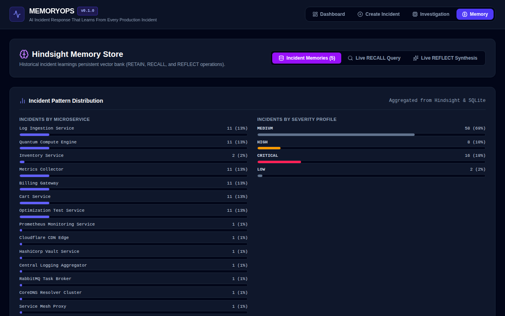
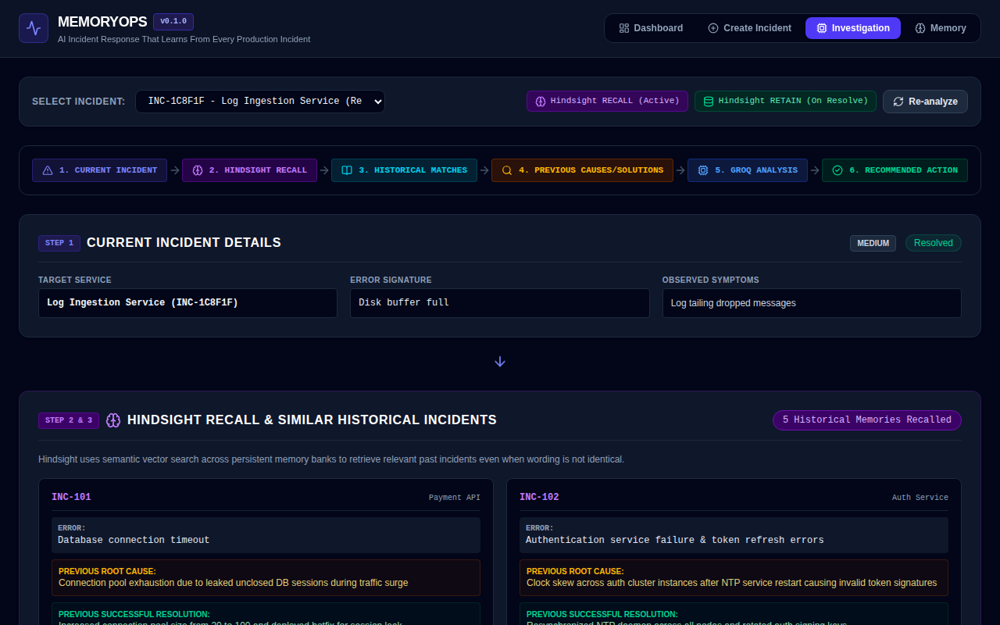

# Building an Agent That Learns from Every Interaction with Hindsight

Picture the 3 a.m. version of this. An alert fires, you open your incident response tool, and the assistant says: *"This looks like INC-214: connection pool exhaustion, fixed by raising max_connections."* You go looking for INC-214 in your issue tracker. It doesn't exist.

That failure mode is why I built MemoryOps. To be clear, INC-214 is an illustrative example of an LLM hallucination, not a captured output: my seed data ends at INC-116, so any citation of INC-214 is invented. During an outage, a fabricated citation is worse than a generic answer because a citation reads like evidence. You either burn minutes verifying it, or you trust it and apply a fix that was never tested anywhere.

I reduced this risk by building persistent memory into the incident lifecycle. Here is how the engineering actually works.

## What MemoryOps Does

MemoryOps is an AI-powered incident response platform for DevOps and SRE teams. The frontend is built with React, Vite, and Tailwind CSS (providing Dashboard, Incident Creation, Investigation, and Memory Explorer views). The backend is FastAPI with SQLAlchemy over SQLite as the system of record for live incidents.

Hindsight acts as the long-term persistent memory layer for resolved incident learnings, while Groq Cloud LLM (`openai/gpt-oss-20b`) serves as the AI reasoning engine. Nothing executes actions autonomously; the human engineer remains in full control.

```
React UI ─► FastAPI ─► SQLite     (incidents, ai_recommendation)
              ├──────► Hindsight  (RETAIN on resolve, RECALL on analyze, REFLECT)
              └──────► Groq LLM   (current incident + recalled text)
```


*MemoryOps dashboard showing live incidents, platform status, and system operations.*

The workflow begins when an engineer declares an incident. Navigating to the investigation page invokes `POST /api/v1/incidents/{id}/analyze`. The backend recalls relevant past incidents from Hindsight, passes them alongside current symptoms to Groq LLM, and presents evidence-backed recommendations. When the incident is resolved, its learnings are stored back into Hindsight memory.

## The Decision: Remember Resolved Experience, Not Raw Logs

Instead of clogging LLM context windows with unstructured log streams, MemoryOps uses [Hindsight](https://hindsight.vectorize.io/) to carry experience across sessions. SQLite answers *"what is happening now,"* while Hindsight answers *"what did we learn last time."*

### RETAIN Runs on Incident Resolution

When an incident is resolved via `POST /api/v1/incidents/{id}/resolve`, `HindsightService.aretain_incident()` formats a structured memory document containing `id`, `service`, `error`, `symptoms`, `severity`, `root_cause`, and `resolution`:

```python
response = await client.aretain(
    bank_id=self.bank_id,
    content=content_text,
    metadata=metadata,
    document_id=incident_id,
    tags=[service, severity, outcome],
)
```

The incident ID serves as a stable document anchor. To prevent duplicate retention calls, the `Incident` database model tracks a `memory_retained` boolean flag. This flag is flipped to `True` only after Hindsight confirms a successful retain operation.

### RECALL Runs on Incident Investigation

When an investigation is triggered, MemoryOps forms a semantic search query from the incident's service, primary error, and observed symptoms:

```python
recall_query = f"Service: {incident.service} | Error: {incident.error} | Symptoms: {incident.symptoms}"
recalled = await hindsight_service.arecall_memories(query=recall_query, max_tokens=2048)
```

The router limits results to the top 5 memories and parses them using `parse_memory_item()`. In `ai_service.py`, these memories are passed directly to the LLM context prompt as grounded evidence.

MemoryOps also implements `POST /api/v1/incidents/reflect` and a Memory Explorer UI tab to synthesize cross-incident patterns across historical outages.


*Memory Explorer interface allowing direct Hindsight RECALL and REFLECT pattern queries.*

## Separating Evidence from Analysis

In the investigation API response (`IncidentInvestigationResponse`), historical evidence and AI reasoning are kept strictly separate:
- `similar_historical_incidents`, `previous_root_causes`, and `previous_resolutions` are populated by backend code directly from Hindsight recalled memories or SQLite records.
- `ai_analysis` contains the structured JSON output returned by Groq LLM.

The UI renders these inputs as distinct visual pipeline stages so the engineer can easily distinguish raw historical facts from AI recommendations.


*The investigation view separates retrieved historical evidence from AI-generated analysis.*

The system prompt enforces strict anti-hallucination guardrails:

```
2. NEVER invent or fabricate historical incidents or incident IDs. Only reference historical incidents that are explicitly present in the provided RECALLED HISTORICAL MEMORIES.
3. If no relevant historical incidents exist or match, explicitly state that no historical incidents were found in Hindsight and base your analysis solely on general DevOps best practices.
```

## Before and After Example

**Before (illustrative hypothetical hallucination):**
> Probable cause: Connection pool exhaustion. Matches INC-214, resolved by increasing max_connections to 100.

**Stored (real seed data in `seed.py` for INC-101):**
- *Root Cause:* "Connection pool exhaustion due to leaked unclosed DB sessions during traffic surge"
- *Resolution:* "Increased connection pool size from 20 to 100 and deployed hotfix for session leak"

**After (verified response structure from `test_ai_service.py`):**

```json
{
  "probable_root_cause": "Database connection pool exhaustion",
  "recommended_action": "Increase max_connections parameter from 20 to 100",
  "confidence": "high",
  "reasoning": "INC-101 historical incident showed identical Gateway Timeout symptoms and was resolved by expanding the pool.",
  "supporting_historical_incidents": [
    "INC-101: Payment API database connection timeout"
  ]
}
```

## Graceful Fallback Handling

When external API keys or Hindsight services are unavailable, MemoryOps degrades gracefully without crashing or fabricating memories.

If Hindsight is offline or returns an error (e.g. HTTP 402 Insufficient Credits), the backend falls back to querying resolved incidents stored in SQLite. If Groq LLM is unconfigured, `_fallback_analysis()` applies rule-based heuristic analysis and explicitly sets confidence to `low`.


*MemoryOps continues incident investigation and displays low-confidence fallback reasoning when Hindsight or Groq returns API authentication or quota errors.*

## Engineering Lessons & Limitations

1. **Schema Separation Over Prompt Trust:** Prompt instructions reduce hallucinations, but programmatic validation of cited incident IDs against recalled sets is necessary for absolute enforcement.
2. **Degraded Mode Must Look Degraded:** When falling back to SQLite, the UI and API explicitly communicate that heuristic analysis was used.
3. **Idempotent Retention:** Tracking a `memory_retained` flag in the primary database prevents duplicate memory entries in Hindsight upon repeated resolution calls.
